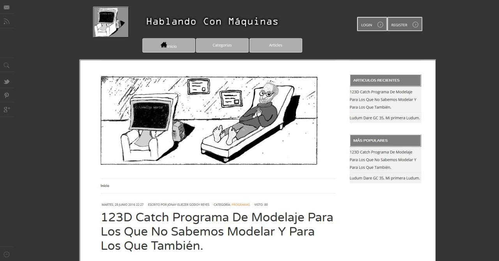
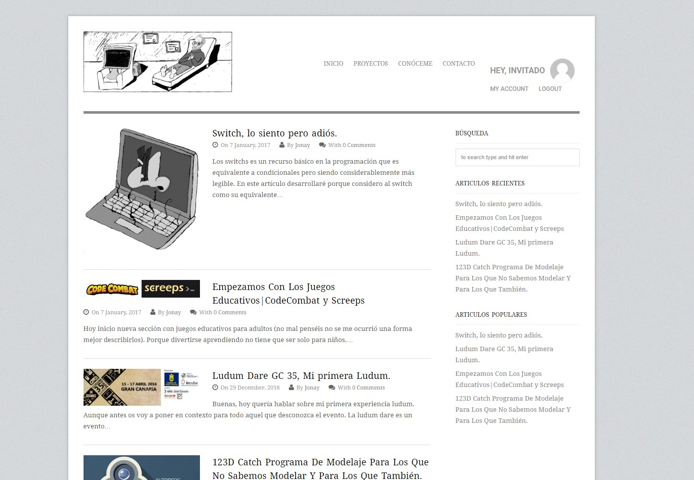

Me parecía adecuado escribir como uno de los primeros artículos
blog. Todo el trayecto que tiene mi blog porque aunque me dé algo
de vergüenza estuve aproximadamente 1 año para montarlo.
Si tuviese que buscar un porque diría que sobretodo cuando se
 trata de necesito sentirme cómodo con el entorno que
utilizo y si no me siento cómodo le doy 20 mil vueltas hasta
que lo consigo o si no nunca llega a ver la luz.

Por supuesto puede que la opción más
obvia fuera hacerme un blog en Medium o sitios similares
pero siendo programador creo que la opción de montarme un blog
en mi contexto me ayudado a aprender.

Como un año es mucho tiempo me gustaría contar mi aventura y
y más concretamente que herramientas he ido descartando hasta
llegar hasta aquí.

## Joomla
En las clases uno de mis profesores me mostró el primer cms con
el que trabaje.

Si ya sé cómo vais a descubrir me gustan los grises, blancos y
negros. Joomla me abrió los ojos al problema de los cms hacer
integración continua en estos entornos cuesta una barbaridad.
No me costo mucho tiempo descubrir que me encanta poder trastear
con comodidad en mi blog. Las herramientas que encontré después de
mucho buscar para intentar hacer un sistema de integración continua
eran complejos de montar y requerían de varias tecnologías bastante
complejas.

## WordPress
Un compañero me hablo de las bondades de este cms frente a Joomla
y además un posible plugin de control de versiones y su fama
me llevaron a darle una oportunidad.

Sí como es no toma el poder de las plantillas a simple vista es
como el mío pero mejor. Tiempo al tiempo. La verdad con WordPress
tuve una curva de aprendizaje más corta que con Joomla. Pero
como ya me suponía tiene todos los problemas principales que
tenía con Joomla. Aun así viendo que ya nunca tendría un blog
monte un sistema muy lento, básico y sobretodo manual de control
 de versiones con el que tardaba en guardar una versión entre
 2 y 5 min. Si el que este el leyendo esto y sepa de integración
 continua de que tardaba minutos para hacer algo que cuesta segundos.

 Me dije a mi mismo vale Jonay ya tienes un blog con el que puedes
 trastear es hora de hacer un deploy. Antes de nada decir que como
 todo bien estudiante que se precie escogí un servidor gratuito.

 Como resultado la página era muy lenta. Por otro lado, tarde una
 vez superada la curva de aprendizaje con los deploys la cosa
 no mejoro mucho. Quiero decir que para hacer un deploy tenía
 que hacer malabares entre el cambio de dominio de local
 al servidor. Así como pelearme con la base de datos para
 solo evitar sobrescribir datos de usuarios. Vale nunca tuve
 verdaderos usuarios tenéis razón. Pero en cualquier caso real
 tendría que preparar el sistema para que mis cambios no
 me destrozaran la base de datos. Y creo yo que le hubiese
 hecho chantaje emocional a algún amigo para que se registrara
 eso nunca falla.

## Gastby js, mi entrada en el mundo de los generadores estáticos.

Si una plantilla hecha a mano tiene ese olorcito especial
del programador novato de frontend.
Volviendo al blog. Por aquí voy a hablar de mi entrada al mundo de los generadores
Estáticos más que de Gastby js en sí. De él solo dire que
Gastby es un generador de páginas estáticos funciona con react.

-¿Por qué no Jekyll?
Puede que me cambie y lo utilice. Simplemente aún no he trabajado
 con él. Pense que me seria más comodo la
curva de aprendizaje con algo basado en JavaScript que con
Ruby. Puede que me equivocará.

-¿Por qué no hexo?
Porque los componentes de hexo .ejs son poco legibles y hay muy
poco material con que trabajar.

-¿Por qué Gastby?
Tenía algo de experiencia con React y estaba en JavaScript.
Sí al igual que hexo también tiene un comunidad pequeña.
Pero se nota que a diferencia de hexo el material que hay
de calidad no está en japonés.

## Generadores estáticos

Guau! y eso que solo hablaría poco de Gastby js.
Siendo objetivo todos mis problemas que tenía con joomla y
WordPress con los generadores estáticos están curados de serie.
Es puro control de versiones luego hago un commit (guardo una
versión) en segundos, puedo depurar en local con un comando
y con otro hacer deploys en menos de 1 minuto.

La página web en muy liviana pesa unos 6MB sin comprimir es rápida
y no nesecita base de datos. Pero Jonay solo tiene 2 artículos.
En WordPress que casi lo mismo pasaba a pesar 400MB y ese no es
el problema la verdad que a mí eso no me importa. Lo que importaba
era lo mucho que me ralentizaba la carga de los artículos por las
continuas llamadas a la base de datos.

## Problemascon los generadores estáticos

-No tienes gestión de usuarios como tal.

-Para tener servicios basicos como comentarios, formularios, etc.
es obligatorio usar herramientas externas como Diqus.

-Hoy por lo que sé es muy complicado de manejar por alguien no iniciado
en la programación o en el control de versiones.
Aunque he visto por encima algunos backend que me dan esperanza
en que más pronto que tarde para blog y landing page se dejen
de usar cms que tiren de base de datos (claro, jonay, lo que tú digas mi niño).

En consecuencia, la principal razón por la que no me gustan lo cms que se basan en
base de datos. Es que al ser difíciles de modificar. Me dificultan enormemente
integrar cualquier posible mejora en mi trabajo una vez puesta en producción
traducido al lenguaje Agile se corresponde por cada mejora que no puedo
integrar el cliente pierde un factor diferenciador que le distinguiría
de la compentecia.

Esto no tiene relación directo con el tema del blog. Debo agradecer a Carlos que
me diese el último empujón porque es muy posible que blog no viera la luz del día
no ser por él y de verla no seria hasta después de bastante tiempo.