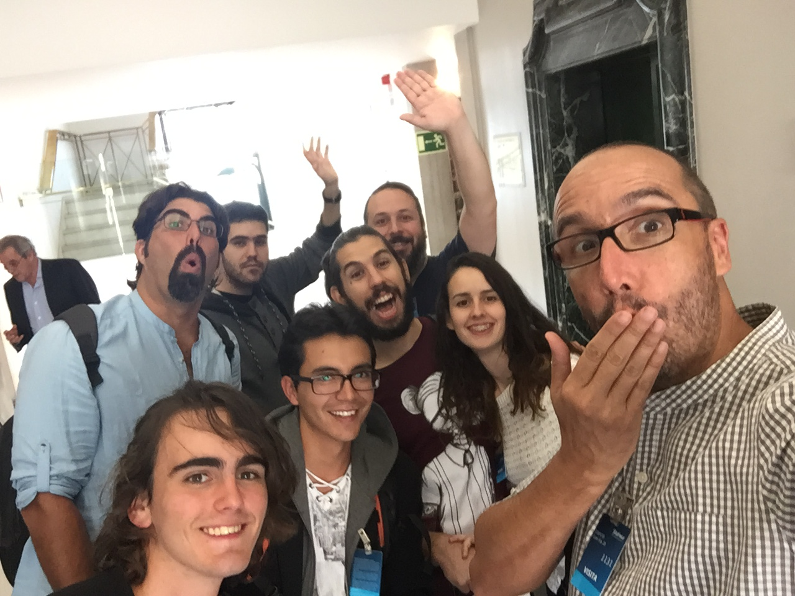

Este es el primer año que hace el HackForGood BigDay por lo que creo que
es una buena idea contar mi experiencia para que otras personas puedan conocerlo
desde mi perspectiva y también en cierta forma para mi yo futuro.

Yo participe en hack for good y quede segundo con el proyecto Amidi.
Tuve suerte, a pesar del que el proyecto no quedo primero pudimos
entrar en la repesca y conseguir una plaza para la final.

Aunque no sea lo más importante la verdad, es que tuvimos los gastos del viaje, alojamiento
 y transporte pagados.No sé para ustedes pero para mi esto es un lujo.

En el aeropuerto, me encontré con otros participante de nuestra cede,
 aprovechamos y nos pusimos al día de nuestros respectivos proyectos.
Asi hasta que llegamos a madrid y nos encontramos con Sergio el encargado de nuestra
cede.

Dejamos las cosas en hotel, fuimos a cenar y nos pasamos parte de la noche
poniéndonos al día y enterándonos del evento de mañana.

## Preparandome la charla

Después de dar una vuelta por las calles de madrid con los otros participantes de nuestra cede
me puse al terminar el pitch, llevaba más de la mitad escrita pero quería esperar 
a hablar con mi compañero para terminarla porque el había tenido un contacto  con escuelas
donde llevo nuestro proyecto.
 
Se comento el tema de presentarlo mi compañero y yo juntos, pero yo me negué según mi experiencia
los pitchs suele funcionar mejor si solo expone 1 y después de hablarlo nos pusimos de 
acuerdo.

Para terminar el día me puse a ensayarlo.A veces me funciona bien lo de memorizar cosas
antes de ir a dormir y repasarlas al despertar porque cuando duermes los recuerdos
pasa a guardarse a la memoria a largo plazo de esta maneras no solo lo tengo en la memoria
a corto plazo y me es más fácil recordar, en teoría.
Por lo que estuve ensayándolo hasta que al menos recordara todo el pitch
de memoria sin mirar el guión.Luego me fui a dormir.

Por la mañana salí sin despertar a mi compañero y me puse a ensayar donde pude.
Quizás otras personas no lo hubieran dedicado horas de sueño a esto.
yo lo vi como una de esas pequeñas oportunidad de dedicar buen número de horas
en mejorar una habilidad realmente importante y que normalmente no le dedico tiempo
porque hay otras prioridades.
 
Por otro lado, hace un tiempo, en un hackathon vi una presentación que me encantó y su secreto
fue ensayarla durante al menos 4 horas.No con estás palabras exactas pero me dio a entender que 
cuando presentas un proyecto cargas con el trabajo del equipo y muchas veces de ti termina 
dependiendo que ese trabajo de resultados".
 
 
## Empezando el Big Day
Cuando nos separamos la noche anterior no definimos a ciencia cierta la hora de diana
no fue muy grave lo único que tuvimos que movernos y desayunar con algunas 
prisas.

Llegamos un poco tarde, pero en esta ocasión era uno de esos evento que arranca entre
10 y 15 min más tarde de la hora. Normalmente, esto me disgusta pero
en este contexto tras salir con prisas y con el cansancio del viaje realmente
agradecí poder sentarme tranquilamente 10 min a esperar que empezará el evento
y creo que otros participantes se sentían como yo, aunque quizás es mucho suponer.
    
## Las Charlas
    
Cuando empezaron las presentaciones yo me peleaba por controlar mi corazón acelerado y 
por eso me afecto especialmente una de las charlas que abría el evento 
de 
<a href="https://twitter.com/FabianGPastor" target="_blank">Fabian Garcia Pastor</a>, 
la apretura si podría resumen 
en "no tengáis miedo disfrutar el momento".

Me ayudo mi hizo recordar que muchas veces pensar en lo que no debes hacer no ayuda.
Puede que este exagerando, pero es considerable como la diferencia del
 pensar en "disfrutar" en vez de pensar "no estar nervioso" me influye.
Creo que la diferencia reside en que con una nos limitamos y con 
la otras nos centramos pero por supuesto esto es mi opinión personal.

Fueron avanzando los grupos y escuchando pequeñas charlas hasta el descanso, incluyendo
esta muy divertida de 
<a href="https://www.youtube.com/watch?v=3w95FZ1g1hc" target="_blank">como hacer un pitch</a>
sobretodo porque más tarde tuve el privilegio de compartir ascensor
con D. César Alierta y Dña. Trinidad Jiménez,
también hablaron del
<a href="https://www.youtube.com/watch?v=icXyBJT7wow" target="_blank">cambio de paradigma</a> 
 y la presentación del director 
de Wayra o los proyectos tecnológicos en la escuela de tenis de rafa Nadal.

Otra charla que me llamo atención fue una sobre **mapas de talento**.La historia de esta
charla comienza unos días antes del Big Day.Me llego un mensaje a ultima hora.
En parte se puede llegar entender que no fuera fácil contactar con todos miembros de los 17 equipos 
 pero tenía un margen de 2 horas para resolverlo estuve a punto
de negarme a hacer el "test".Sin embargo ahora me alegro de haber participado.
Pongo "test" entre comillas porque creo que realmente se trata de un mapa de talento digital y
no solo tiene el formato clásico de un test. 

Pero todo sea dicho el "test" me encanto.Generalmente, los test son para mi papel mojado,
 porque si bien sabes que los test pueden ser útiles si
se hacen bien la mayoría de los que me llegan son demasiados genéricos y como mucho solo
dicen medias verdades.Este en cambio, me pareció desde mi ignorancia en esta clase de temas bien
hecho y además en mi caso acertó con cierto nivel de detalle.

Dejo 
<a href="https://drive.google.com/open?id=0B2JGlpvHuADfdXZBdmlRNUotM1k" target="_blank">los resultado de mi test</a>
 aunque me da un poco de vergüenza publicar mis resultados
espero que sirva para que podáis valorar el mapa mental.También dejo 
<a href="https://dtmaptest.com/" target="_blank">el enlace a la página</a>
 donde hice el test actualmente creo que no se puede acceder a los "test" pero quien sabe. 

En la charla se comentó los resultados generales y haciendo énfasis 
los perfiles que habían encontrado.
la verdad es que fue interesante sobretodo para los que lo hicieron.

Por ultimo, se presentó el curso de
<a href="https://miriadax.net/web/siete-habilidades-clave-en-la-era-digital-2-edicion-/inicio" target="_blank">siete habilidades clave en la era digital</a>

1. Comunicación y Storytelling - Ángel González

2. Creatividad - Fabián García Pastor

3. Emprendimiento - Luis Miguel Olivas

4. Empatía digital - Alfredo Corell

5. STEM - Juan Medina

6. Gestión de la información y Pensamiento crítico - David Carabantes

7. Programación - Juan Quemada

Que como bien decían en la presentación son habilidades que nunca se terminan de aprender del todo
y le echaré un vistazo parece interesante. Aunque en la séptima creo que ya tengo un ligera idea.

Hubieron más charlas y no nos olvidemos de las presentaciones, todo ello interesante pero aquí recojo lo que más llamo
la atención.

##Mi Presentación

Justo después del descanso me tocaba presentar a mi. No estaba demasiado nervioso
la pausa me ayudo fui al baño y después vi algún proyecto de otros equipos.

Se acabo el descanso, me llamaron subí al escenario, me vendí y termine.
Realmente una charla es simplemente eso.

La personas con las que hable antes y después
del evento me dieron muy buen feedback. Creo que a día de hoy es la mejor presentación
que hecho en mi vida y aunque eso puede que no sea mucho para mi es punto de referencia.

<iframe src="https://drive.google.com/file/d/0B2JGlpvHuADfVUZqMDcxaDJTeDg/preview" width="640" height="480"></iframe>

He decidido subir mi presentación en video más sobretodo para recordarla dentro de unos años.
Por supuesto el feedback es bienvenido. Desde mi punto de vista algunos de mis errores
de los cuales ninguno fue grave, uno fue que estaba acelerado.Por lo que muchas veces perdía
un poco el control de lo que pasaba a mi alrededor, del guión y de mi voz.
Aunque haberlo memorizado ayudo a compensarlo.
El segundo creo que es algo le suele ocurrir a todo el mundo.
El problema es ,que como yo me escucho, es distinto a como me oyen los demás eso afecta
 a mi tono y timbre además vocalizar un poco no me
vendría mal. De todas maneras como dije el feedback que me dieron fue muy positivo y 
estoy satisfecho con el resultado.

##Proyectos ganadores

**1º** premio. **Same Bullying** para prevenir el acoso en redes sociales
<a href="https://twitter.com/SAMEBullying" target="_blank">+info</a>

**2º** premio. **Luz Verde** Su propuesta técnica es capaz de “traducir” el estado de los semáforos para ayudar
 a las personas invidentes
 <a href="https://www.youtube.com/watch?v=sAzv6crvTx8&feature=youtu.be" target="_blank">+info</a>

**3º** premio. **Easy Moves** adapta la silla de ruedas eléctrica convencional para que pueda ser controlada a través de una aplicación por reconocimiento de voz,
 tracking de la cabeza y estímulos cerebrales.

Ninguno de nuestra cede resulto, ganador.Había proyectos muy buenos según creo 
en varios casos solo tuvieron 1 pto o 2 de diferencia, 
llegando a ocurrir que el 2º y el 3º tercer puesto empataron.Por lo que no hay nada de que 
lamentarse.

Los proyectos la cede de las palmas fueron PicComunica
<a href="https://twitter.com/PicComunica" target="_blank">+info</a> 
que después del big day han obtenido un segundo premio en Venture4Grancanaria ,
el mio Amidi
<a href="http://www.aprendeconamidi.com/" target="_blank">+info</a>,
y Keekuo 
<a href="https://twitter.com/Keekuo_" target="_blank">+info</a>

##Almuerzo y Visita a  <a href="https://twitter.com/WayraES" target="_blank">WayraES</a>

Después del evento almorzamos en la sala del consejo de administración de telefónica
que aunque no fue muy interesante, si que fue muy divertido 
el lugar era impresionante en muchos sentidos con vistas de todo madrid.
 Sentarte alli, molaba mucho te daban ganas de soltarte un risa malvada buajajajaja.
No solo me afectaba a mi se notaba como
al entrar cambiaba el estado de animo de lo equipos como dije esto no fue
para nada importante pero si fue bastante divertido.La foto no le hace justicia a la sala.

Por ultimo fuimos a Wayra, escuchamos dos proyectos. Los
proyectos eran interesantes pero centraré en Wayra. Wayra junto a open future 
una de las principales incubadoras de telefónica. Para estar en Wayra se debe haber
pasado por open future.

Algunas cosas que más me llamaron la atención sobre Wayra:

- El lugar físicamente es como un coworking con estilo propio esta bastante bien.
- Solo 1 o 2 % de las personas que se presentaba para el open future llega a Wayra.
  La estadística estaba justifica por la enorme cantidad de proyectos que intenta entrar
  open future.
- Estando dentro de Wayra, si quieres aprender casi cualquier cosa puedes llamar
 y te traen a un mentor para que venga en persona a enseñarte.
- Wayra financia tu proyecto con alrededor de 100.000€ si no recuerdo mal, más licencias
 para todo tipo de programas.
 
 
 ## Impresiones Personales
 
Cuando participe en el hack for good en las palmas, a pesar de estar rodeado de personas sobresalientes
no fui capaz de conocer a nadie fuera de mi grupo, debido al caos que hay 
en cualquier hackathon.Para ser sincero casi no me acordaba de sus caras.
Me alegro de haber tenido esta segunda oportunidad para acercarme a ellos y a
<a href="https://twitter.com/sergiotrasmallo" target="_blank">Sergio Sánchez</a>
el encargado de nuestra cede, solo por eso valió la pena el viaje.
 
 

Por otro lado me llevo una sensación un poco amarga.
Sin ser un sentimiento malo del todo, me sentí abrumado.
Estar rodeado de tanto profesionales que serán mejores o peores que yo en distintas
cosas pero que en general saben trabajar tanto de otros grupos, como los que nos presento
telefónica me hace sentir como pez en medio del océano.Entre tantos profesionales competentes
¿Como se marca la diferencia? 

Todo esto fue solo un gran día de mi vida.Fue muy enriquecedor e intenso.
Siempre me sorprende lo que se puede hacer con solo 24 horas bien organizadas,
Por ultimo, gracias a la 
<a href="https://twitter.com/ULPGC" target="_blank">ULPGC</a>
 , a telefónica y todas la personas que trabajaron para
que yo pudiera vivir este día.

