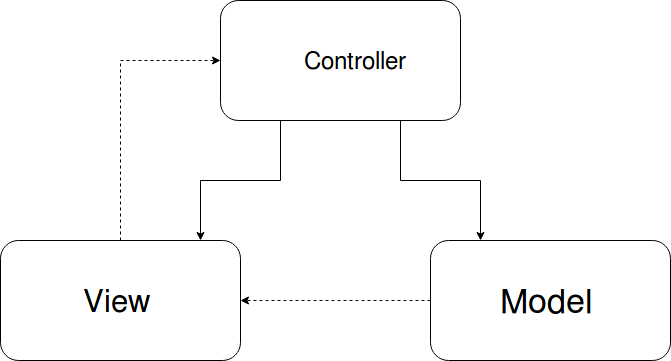
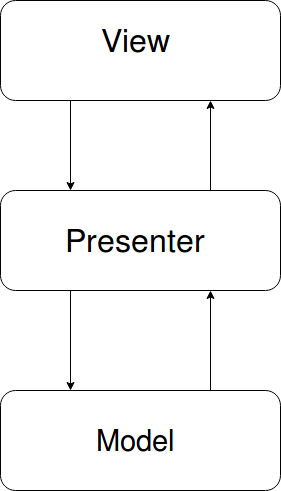

Hace muy poco me enseñaron la arquitectura modelo-vista-presenter con vista pasiva en javascript 
y no pude resistirme a hacer una prueba de conceptos. 
El punto fuerte de esta arquitectura es que permite un desacoplamiento bastante bestia de la
de la tecnología que se utiliza para interactuar con el DOM. Facilitando los test y teniendo
la libertad de usar la tecnología que se adapte al contexto.

Vale, ahora que ya os he comentado las cosas buenas de la MVP con vista pasiva. Voy a desglosar
en que consiste, luego mostraré mi prueba de conceptos y por terminaré por explicar las 
ventajas e inconvenientes de esta arquitectura.

Desglosando MVP con vista pasiva
-----------------------------------------------------------------------------------------------------

**Modelo-vista-presenter**

Seguro que muchos conocéis el **modelo-vista-controlador**. En este modelo separamos los elementos de
nuestro programa según se corresponda con la interfaz de usuario, la vista, si estos elementos
se corresponde con como persisten los datos es el modelo y punto que sirve de enlace entre la vista
y el modelo es el controlador. También recordad que el modelo puede llamar a la vista y mostrar sus
datos ya actualizados pero la vista nunca puede llamar al modelo.

   

El **modelo-vista-presentador** mantiene el mismo concepto de separar las responsabilidades pero
es el presenter (alias controlador en mvc) quien se ocupa tanto de controlar los eventos de la vista como de cargar la 
información del modelo.

Llegamos al **mvp con vista pasiva**.Aquí se mantienen los mismos conceptos que con el mvp.
Salvo que nuestra vista va a ser **tonta**, la vista no va contener ninguna clase de lógica.
Simplemente va a tener una ordenes lo más básicas posibles que ejecutará el presenter.

Con esto se consigue ese desacoplamiento del que hablamos antes. Si la vista no tiene ninguna
lógica podemos cambiar la tecnología que utilizamos simplemente debemos cambiar el modo en
que se renderizan los elementos para cambiar de tecnología.
  