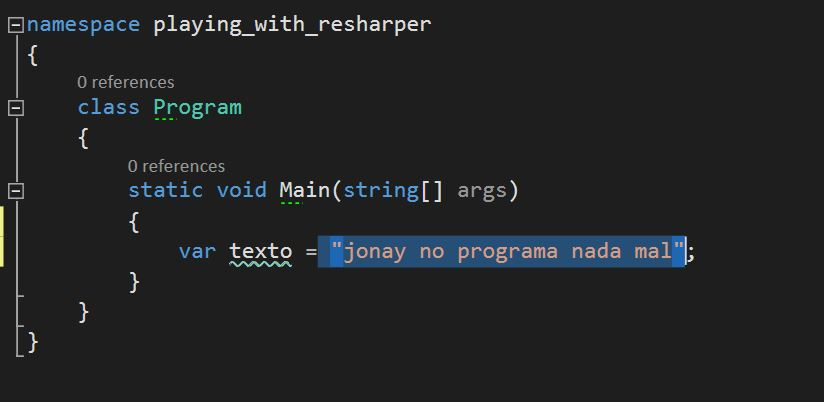
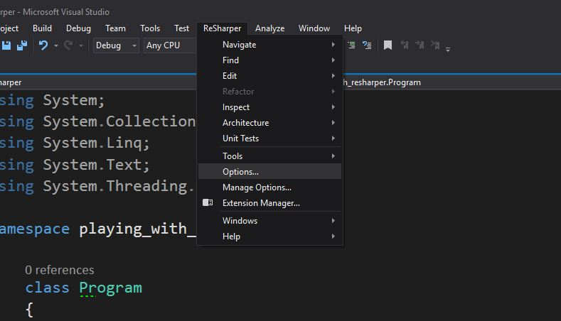
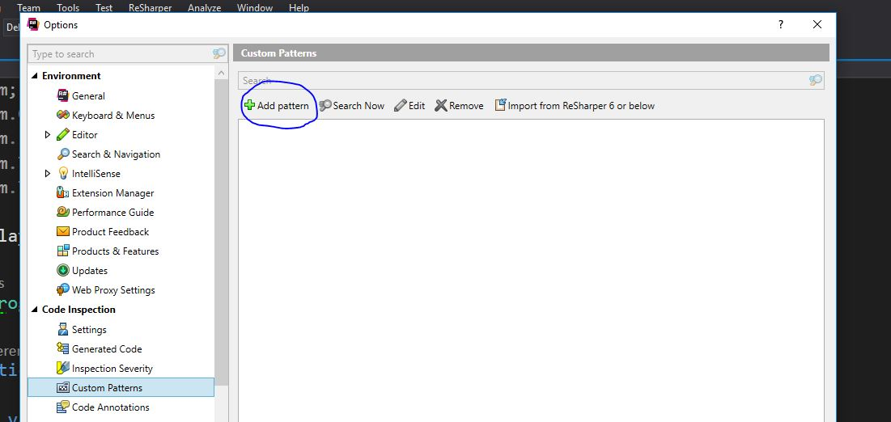
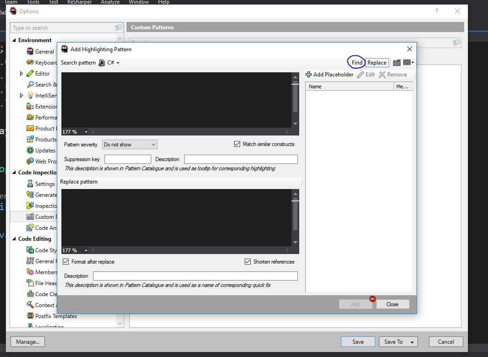
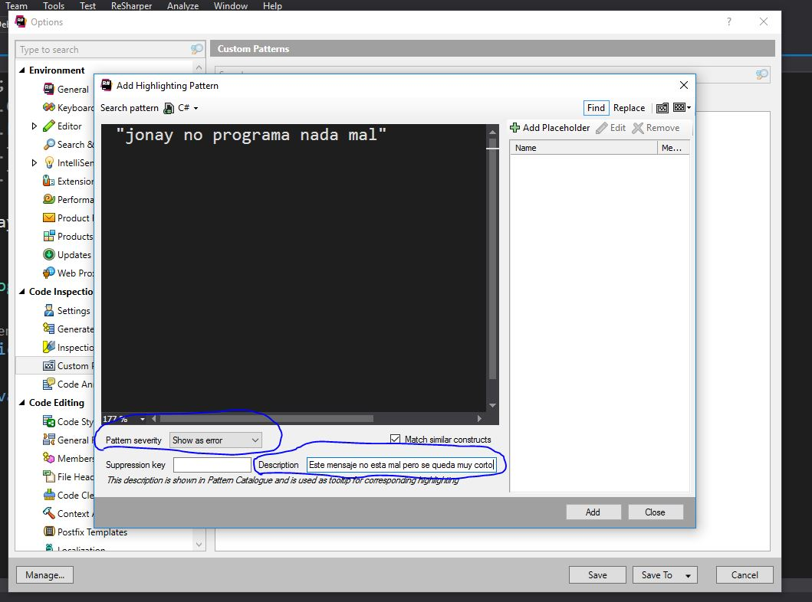
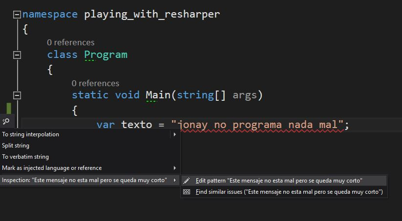

Hace poco que he empezado a tocar c# y con el visual studio.
Por supuesto, esto incluye el plugin ReSharper de jetbrains para visual studio.

El plugin tiene un montón de funcionalidades muy potentes, la que más destaca a 
mi parecer son sus refactor automáticos. Sin embargo, hoy hablaré otra funcionalidad
menos espectacular pero muy útil Search Pattern o patrones de búsquedas y
como un pequeño extra también explico como exportar estas y otras configuraciones de reSharper.

Search Pattern
-------------------------

Vamos a empezar con un ejemplo de Search Pattern bastante sencillo.

En la imagen que acabamos de ver, tengo una string seleccionada. Vamos a 
imaginar por un momento que esa string por lo que sea para nuestro equipo
de trabajo representa un mal olor. Si ese mensaje no esta mal pero no
termina de expresar todo lo que debería.

Por eso, nos interesa que si un miembro del equipo se encuentra con un
caso similar al mio, sea el mismo IDE el que le avise que se encuentra ante
un mal olor. Aquí es donde aparecen los **Search Pattern**.

**Hay dos maneras de hacer un search pattern** 

- De cero.(Ancla)
- A partir de un fragmento de código.(Ancla)

-------------------------------------

**De cero.**

Vamos al menu de ReSharper y dentro de este vamos a Options.
    

Dentro nos aparecerá el siguiente menu y pulsamos sobre add pattern

Siguiente paso, después de que aparezca la siguiente ventana pulsamos en Find para
movernos a la ventana donde estaremos trabajando. Tranquilos ya volveremos al tema del
replace más adelante.

Ya hemos llegado al ventana de Find. Yo os la muestro aquí ya rellena.
Pero esta parte es bastante sencilla en el gran cuadro ponemos los que queremos
que busque, en **pattern severity** ajustamos el tipo de warnings que mostraremos
cuando se produzca este mal olor. Para mi este error es imperdonable y voy a poner
error y la description es eso, la descripción que va ha aparecer junto a nuestro warnings.

Le damos a Add, nos retornará a la anterior ventana y luego pulsamos en save.
Y magia ya nuestro propio editor es el que nos avisa de este nuevo mal olor.

--------------------------------------

**A partir de un fragmento de código.**

Un marcador de posición tiene el siguiente formato:
 $ placeholder_name $ - where placeholder_name es un identificador arbitrario.
 
Cada marcador de posición se debe definir una vez y se puede usar varias veces en el patrón. 
Al definir un marcador de posición, debe definir sus restricciones tipo y opcional. Hay cinco tipos de marcadores de posición:

Argumento Placeholder: uno o más argumentos en una invocación a un método.
 Si es necesario, puede especificar el número mínimo o máximo de argumentos que deberían coincidir.

Expression Placeholder - una secuencia de operadores y operandos.
 Opcionalmente puede especificar un tipo que devuelve esta expresión.

Identificador Placeholder - cualquier identificador de símbolo. 
También puede especificar una expresión regular que se utilizará para hacer coincidir nombres de símbolos.

Marcador de posición de extracto: 
una sentencia de línea única que termina con un punto y coma o un bloque de instrucciones. Si es necesario, puede especificar el número mínimo o máximo de declaraciones que deberían coincidir.

Escriba Placeholder:
 un tipo de valor o un tipo de referencia. De forma predeterminada, 
 un marcador de posición de este tipo coincidirá con cualquier tipo, 
 pero puede especificar un tipo específico explícitamente.

Tenga en cuenta que es muy importante elegir los tipos correctos de marcadores 
de posición para partes específicas de su patrón. 
Si su patrón no coincide con el bloque de código al que corresponde,
 el problema suele ser con tipos de marcadores de posición elegidos incorrectamente.