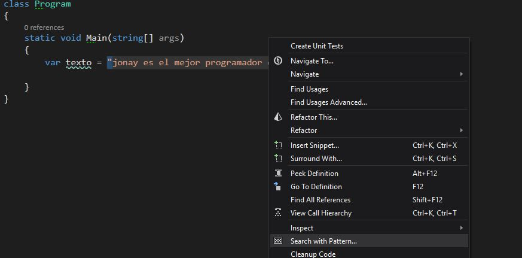
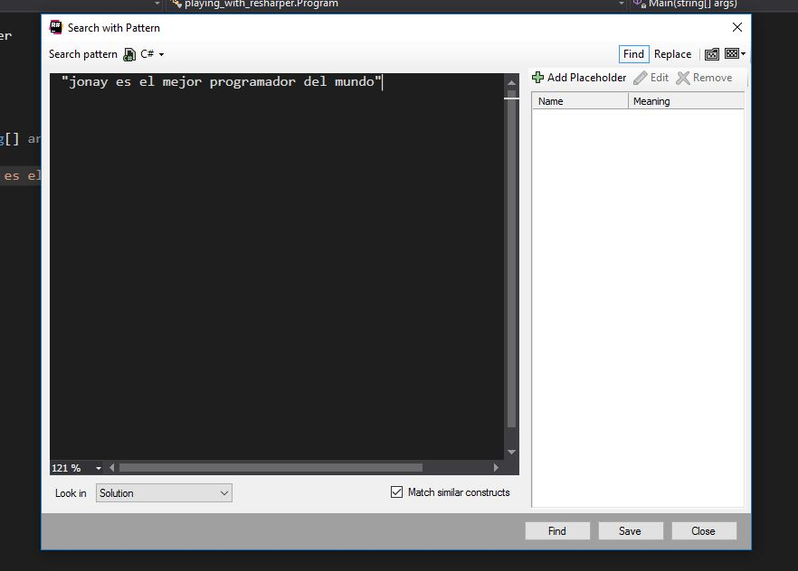
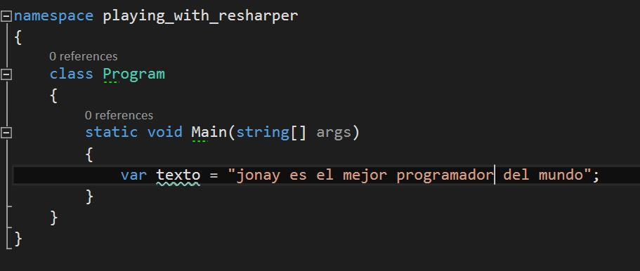
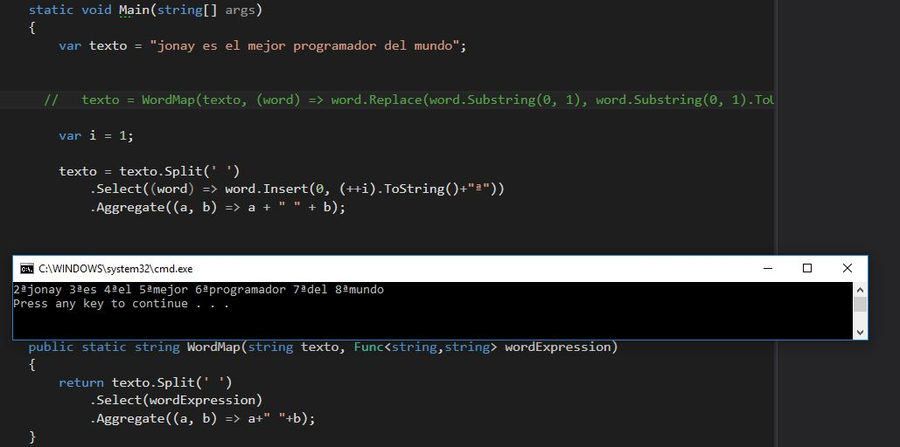
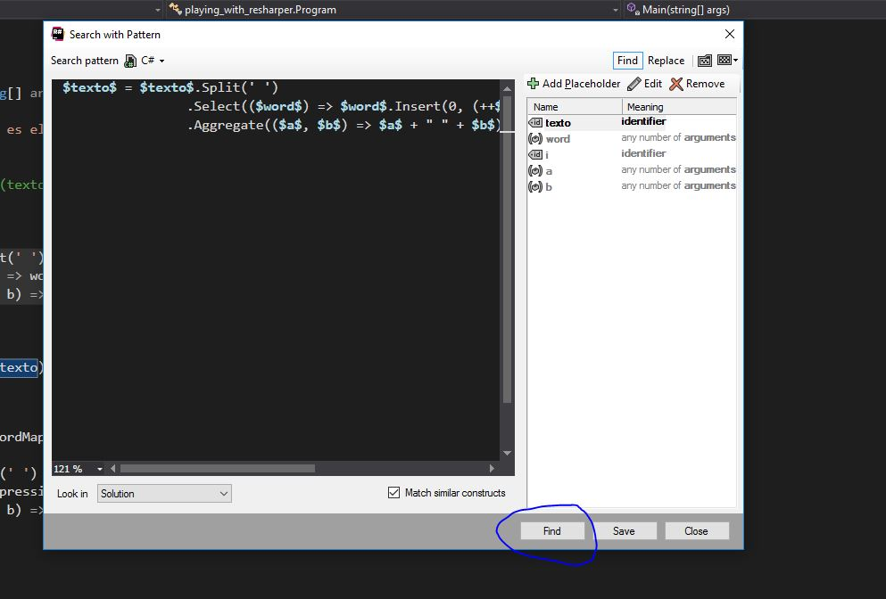

Hace poco que he empezado a tocar c# y con el visual studio.
Por supuesto, esto incluye el plugin ReSharper de jetbrains para visual studio.

El plugin tiene un montón de funcionalidades muy potentes, la que más destaca a 
mi parecer son sus refactor automáticos. Sin embargo, hoy hablaré otra funcionalidad
menos espectacular pero muy útil Search Pattern o patrones de búsquedas y
como un pequeño extra también explico como exportar estas y otras configuraciones de reSharper.

Search Pattern
-------------------------

Vamos a empezar con un ejemplo de Search Pattern bastante sencillo.

En la imagen que acabamos de ver, tengo una string seleccionada. Vamos a 
imaginar por un momento que esa string por lo que sea para nuestro equipo
de trabajo representa un mal olor. Si ese mensaje no esta mal pero no
termina de expresar todo lo que debería.

Por eso, nos interesa que si un miembro del equipo se encuentra con un
caso similar al mio, sea el mismo IDE el que le avise que se encuentra ante
un mal olor. Aquí es donde aparecen los **Search Pattern**.

**Hay dos maneras de hacer un search pattern** 

- De cero.(Ancla)
- A partir de un fragmento de código.(Ancla)

-------------------------------------

**De cero.**

Vamos al menu de ReSharper y dentro de este vamos a Options.
    

Dentro nos aparecerá el siguiente menu y pulsamos sobre add pattern

Siguiente paso, después de que aparezca la siguiente ventana pulsamos en Find para
movernos a la ventana donde estaremos trabajando. Tranquilos ya volveremos al tema del
replace más adelante.

Ya hemos llegado al ventana de Find. Yo os la muestro aquí ya rellena.
Pero esta parte es bastante sencilla en el gran cuadro ponemos los que queremos
que busque, en **pattern severity** ajustamos el tipo de warnings que mostraremos
cuando se produzca este mal olor. Para mi este error es imperdonable y voy a poner
error y la description es eso, la descripción que va ha aparecer junto a nuestro warnings.

Le damos a Add, nos retornará a la anterior ventana y luego pulsamos en save.
Y magia ya nuestro propio editor es el que nos avisa de este nuevo mal olor.

--------------------------------------

**A partir de un fragmento de código.**

Esta forma es más rápida. Seleccionamos el código a partir del cual queremos crear un nuevo patrón
le damos al botón secundario y pulsamos sobre "Search with Pattern...".

A continuación nos aparecerá un nuevo modal parecido a otros que hemos visto con anterioridad.
Le damos a guardar.

Tras eso nos parece un pequeño que nos avisa de que nuestro nuevo patrón 
se a guardado y lo podemos encontrar dentro de opciones.Le hacemos caso y nos vamos a
buscar el nuevo search pattern en las opciones.

Listo, ahora podemos ajustar el pattern severity para que nos aparezca el warnings y a diferencia
de cuando lo hacemos de cero ahora nos va coger el propio código seleccionado como descripción por
defecto, cosa que por supuesto podemos cambiar pulsando edit.

**Creando nuestro propio refactor automático**

Ahora que ya hemos creado nuestro search pattern vamos a ir un paso más alla.Partiendo de este
search pattern podemos preparar refactor automáticos.Volvemos a Reshaper -> options.. 
y dentro entramos al menu de custom pattern donde volveremos a editar nuestro patron está
vez sobre la pestaña replace.

Esta vez encontraremos un segundo recuadro donde pondremos el código que va a reemplazar al
primero. En este caso sustituiremos "jonay no programa nada mal" por 
"jonay es el mejor programador del mundo". También tenemos un nuevo campo description 
esta descripción es la que aparecerá en las opciones para refactorizar.
Una vez lo tengamos todo configurado guardamos.

Ahora si volvemos a nuestro código, podemos ver como además de mostrarnos un warnings nos muestra
unas opciones para refactorizar de manera automatica.

**Un caso real**

Hasta aquí, la parte más sencilla aunque sé que todo el mundo esta deseando que comparta este 
patron esencial para todo programador voy poner un ejemplo en un contexto más real.

Supongamos que en nuestro equipo de trabajo, tenemos que trabajar procesando palabras.
Entonces, en este contexto separar palabras y hacer algo con esas palabras en una rutina
casi diaria para nosotros.

Hoy nos encontramos haciendo un método que separe las palabras de una frase las ponga en 
mayúsculas y las vuelva a unir (perdón, se que existe un Join no se porque no lo recordé 
hasta terminar el ejercicio).

Pues digo basta estoy harto de escribir Split, Select, y Aggregate una y otra vez por todo
mi código y decido crear un método para que yo y mi equipo puedan utilizar.

Hasta aquí todo perfecto. Pero un dia otro miembro de equipo se encuentra en situación de 
usarlo. Sin embargo, desgraciadamente no se acuerda, es normal, con el tiempo se han
ido acumulando métodos en el equipo y empieza a ser un esfuerzo adicional acordarse de todos.
No importante este método enumera las palabras (existen otras maneras más declarativas de
escribirlo pero para no añadir una complejidad innecesaria a los siguientes pasos lo 
construí asi.)

Para resolver este problema vamos a construir un search pattern que nos sugiera que existe
una implementación alternativa y nos proporciones un refactor automático.
Para ellos voy a seleccionar el fragmento de código del que queremos detectar con un
warnings y pulsamos el botón secundario del ratón para después pulsar sobre "Search with pattern...".
Nos aparecerá un modal, antes de seguir avanzado vamos a fijarnos en algunas cosas que han cambiado
respecto al ejemplo anterior.
 

 
 

Un marcador de posición tiene el siguiente formato:
 $ placeholder_name $ - where placeholder_name es un identificador arbitrario.
 
Cada marcador de posición se debe definir una vez y se puede usar varias veces en el patrón. 
Al definir un marcador de posición, debe definir sus restricciones tipo y opcional. Hay cinco tipos de marcadores de posición:

Argumento Placeholder: uno o más argumentos en una invocación a un método.
 Si es necesario, puede especificar el número mínimo o máximo de argumentos que deberían coincidir.

Expression Placeholder - una secuencia de operadores y operandos.
 Opcionalmente puede especificar un tipo que devuelve esta expresión.

Identificador Placeholder - cualquier identificador de símbolo. 
También puede especificar una expresión regular que se utilizará para hacer coincidir nombres de símbolos.

Marcador de posición de extracto: 
una sentencia de línea única que termina con un punto y coma o un bloque de instrucciones. Si es necesario, puede especificar el número mínimo o máximo de declaraciones que deberían coincidir.

Escriba Placeholder:
 un tipo de valor o un tipo de referencia. De forma predeterminada, 
 un marcador de posición de este tipo coincidirá con cualquier tipo, 
 pero puede especificar un tipo específico explícitamente.

Tenga en cuenta que es muy importante elegir los tipos correctos de marcadores 
de posición para partes específicas de su patrón. 
Si su patrón no coincide con el bloque de código al que corresponde,
 el problema suele ser con tipos de marcadores de posición elegidos incorrectamente.