Me pareció interesante el concepto de analizar los errores que han llevado al fracaso de un proyecto
y documentarlo. Puede que al escribirlo ordene un par de ideas en mi cabeza, al documentarlo
me asegure que no se me olvide y me acostumbre un poco al hablar de mis fracasos.
Asi empezaré a aceptar que por muy inteligente que me vuelva siempre cometeré errores.
Y aunque con este proyecto en general no cometí ninguno grave si que cargo con algunas cicatrices de otros proyectos 
y de lo que no son proyectos.Pero no me atrevo a empezar con los proyectos en los que
la culpa fue totalmente o mayormente mía, quizás mañana tenga la autoestima más alta y haga pero hoy no.

Este fue el articulo que me dio la idea.
<a href="https://www.genbetadev.com/trabajar-como-desarrollador/por-que-escribir-un-post-mortem-por-cada-proyecto-de-software-fallido-deberian-ser-obligatorio" target="_blank">
    ¿Por que escribir un post mortem?
</a>

El Proyecto
----------------------

¿Que fue Amidi? Amidi, empezó como un reto presentado en una de las ediciones del hackForGood.
Uno de los representantes de un colectivo con 30 años de vida.
Quería traer al mundo virtual un juego de mesa de cultura canaria
para poder llevarlo a las escuela porque no se podía permitir los coste de los materiales
y la distribución del juego.
Tras ese fin de semana de estrés y 1 hora de sueño.
Quedamos en un más que respetable segundo puesto sino recuerdo mal.

El resultado final fue un quiz, estilo duolingo donde se pueden ir recuperando páginas
de las historias canaria que nuestra simpatica cabrita se comio por error.
Pudimos a través de unrespeca llegar a la final nacional del hackforGood.
Por aqui tengo otro articulo hablando de ello
 <a href="../hack-for-good-big-day/" target="_blank">
HackForGood BigDay
</a>.
Por aqui dejo la página del proyecto.
<a href="http://www.aprendeconamidi.com/" target="_blank">
    Aprende con Amidi
</a>

Dejo la foto del equipo.
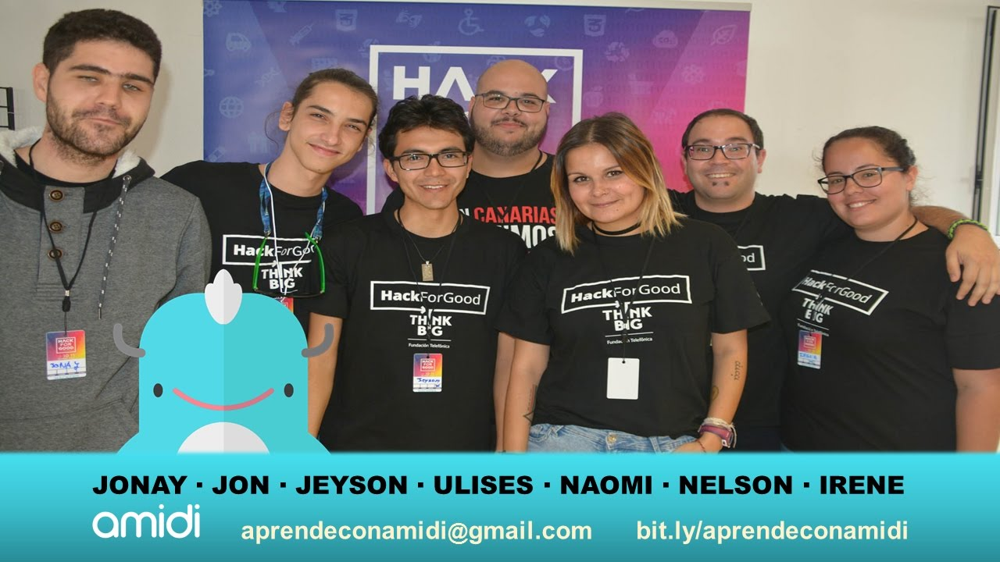

Ya lo se salgo horrible en la fot.Esa es la cara de alguien 
que dormido solo 1 hora y no bebe cafe ni burn. Conclusión 
podeís trabajar igual de bien sin burn, ni cafe que la personas
que las toman pero en las fotos saldréis hechos basura a diferencia
de vuestro compañeros que tienen un brillo especial en los ojos
a causa de las drogas. ;)
 

Problemas a nivel de equipo.
----------------------

Es interesante, pero teníamos la mayoría de cosas que muchos proyectos
desearían tener para empezar una comunidad en la que partir.

- Partimos de 600€ del premio en hackaton para gastos varios.
- Quien presento el reto tenia detrás de el una gran comunidad de potenciales
usuarios y contactos para introducir el juego en las escuelas canarias.
 - Al ser un proyecto de cultura tradicional y tecnologia teníamos posiblidades
reales de conseguir financiación por distintas vias.
- Un equipo que tenia perfiles que se complementaban.

Que es lo que puede destruir este buena base, **problemas en el equipo**. Como esto es muy vago en
las siguientes lineas describiré con más detalle los problemas que surgieron.Y aunque 
no lo parezca ninguno de ellos fue por discusiones la verdad es que todos ellos me caian bien
entonces y me siguen cayendo bien hoy.

- **Miembros del equipo que no ayudan pero no perjudican**.Si estas en un equipo no te ves trabajando,
pero no quieres irte porque piensa que el proyecto es interesante. No te quedes, o deja claro
perfectamente lo que estás dispuesto esto aportar y solo eso.
Si no lo haces vas a perjudicar al equipo aunque no quieras.Metiendo ruido 
a las personas que están organizando porque te tienen en cuentan y van
a perder su tiempo yendo detrás tuya. Quizás en un primer momento no lo veas 
pero cuando te de cuenta, te **coraje** y dí de que no vas a trabajar se honesto contigo mismo
 y **comunicalo** al equipo.

- **No avisan de que no van a entregar el trabajo acordado**.
En nuestro caso era un proyecto que haciamos en nuestro tiempo libre.
Se entiende que hay circunstancias personales por lo que no puedas cumplir las tareas o incluso
si eres solo un vago realmente no importa, no importa que las tareas se acaben o no **hay algo
más importante**.Levanta la mano y **comunica** que no vas a cumplir con la fecha de entrega
o que directamente no la vas a hacer.No importa si no la vas a hacer,ya yo lo hago o se deja sin hacer
pero por favor dimelo. El ruido que tuve a veces en la cabeza por no saber quien estaba trabajando
y quien no es horrible. Al final supones que nadie trabaja y eso hace mucho daño a la moral. 
Este fue un sentimiento que sufrieron varios miembros del equipo incluyendome.
Por supuesto no es bueno no entregar la tareas, pero no avisar de que no se va entregar
es muchisimo peor.

Problemas a nivel personal.
----------------------
 
Creo mi principal error fue ver estos problemas y no atajarlos.No estoy ciego lo veia.
No hablo de enfadarse y gritar, mi actual jefe es increible hablando y manejando los problemas
a nivel de equipo y no nesecita de esa clase de cosas para que el equipo avance.
Te dire un secreto, hagan bien las cosas o las hagan mal, tratar a las personas como seres humanos 
por extrano que parezca es lo que mejor resultados produce.

Como dije antes no habia ninguna persona toxica en el equipo.
Tener el **coraje** no solo para hablar de los problemas de manera honesta comprendiendo las necesidades
de los demás, dando a conocer las mis nesecidades y las del equipo. 

También me falto el **coraje** para analizar los distintos problemas que surgian.
Para ser sincero no me atrevi ni siquiera a pensar en estos problemas en su momento.
**Mi peor comportamiento** fue evitar analizar los problemas a nivel de equipo.
Supongo que si los analizaba tendría que enfrentarlos y ya solo eso me asustaba.
Casi como un reflejo evitaba pensar en ello.
**No pude enfrentarme a la realidad**.

Despedida
----------
Cuando escucha que 2 de los principales valores del extreme programming son la comunicación
y coraje. No piensas hasta que punto estos 2 simples valores son tan díficiles de cumplir.

Por otro, lado a veces veo cosas que me recuerdan a Amidi y una parte de mi quiere que siga
vivo. Ya se pasándole el proyecto a un compañero retomandolo yo, pero probablemente esto
no pase. Habían tantas personas que nos apoyaban y querían que el proyecto avanzara
que es triste decirle adiós. Sin embargo, en mi contexto actual no seria inteligente
dedicarle tiempo iría en contra de mis necesidades.
Si os fijáis no puedo evitar usar palabras como "probablemente" o "contexto actual" esa
es la parte de mi que se niega a dejarlo morir
aunque sepa que ya nunca más voy a trabajar en ese proyecto.

<iframe width="560" height="315" src="https://www.youtube.com/embed/AKh0HpbfRF8" frameborder="0" encrypted-media" allowfullscreen></iframe>

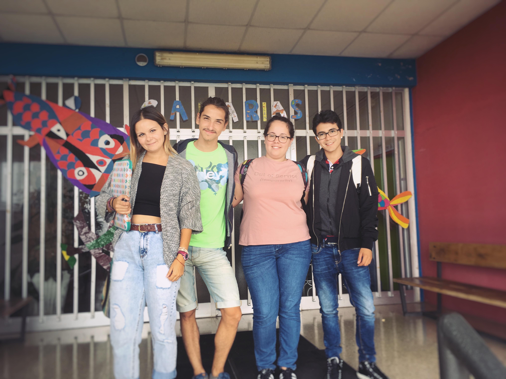

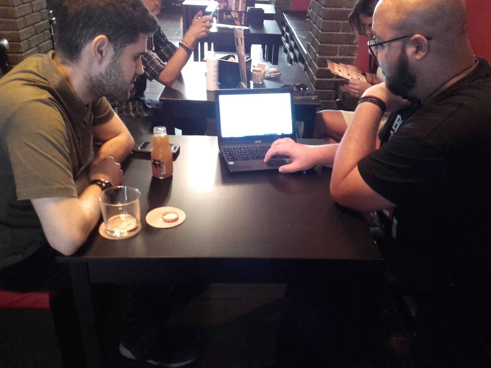

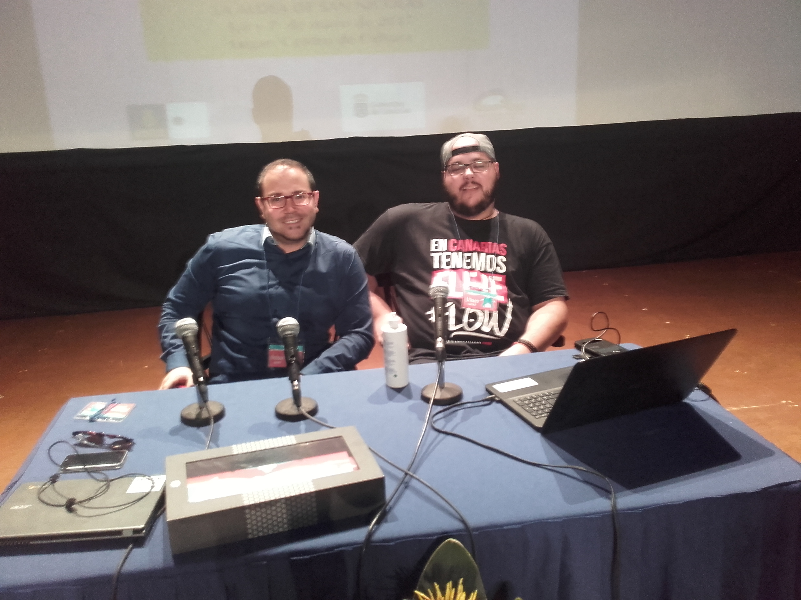

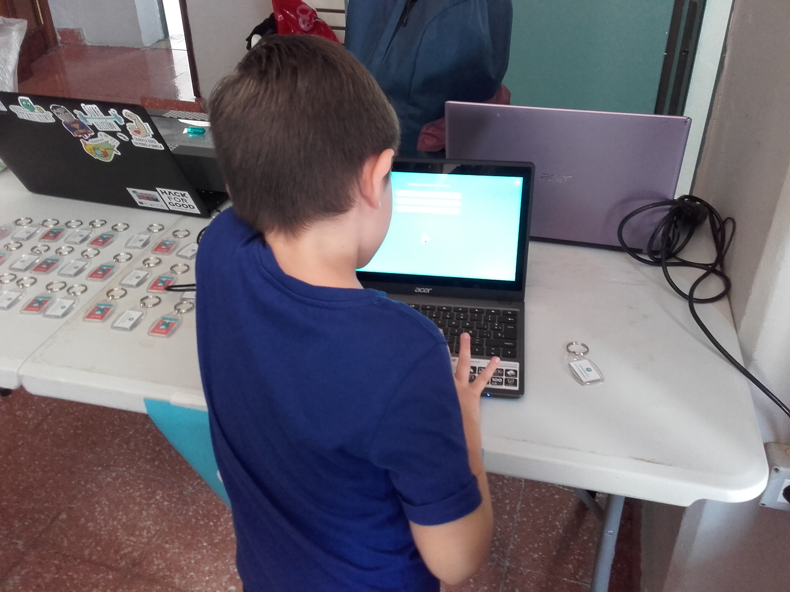

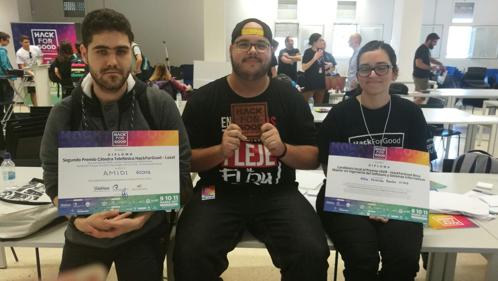

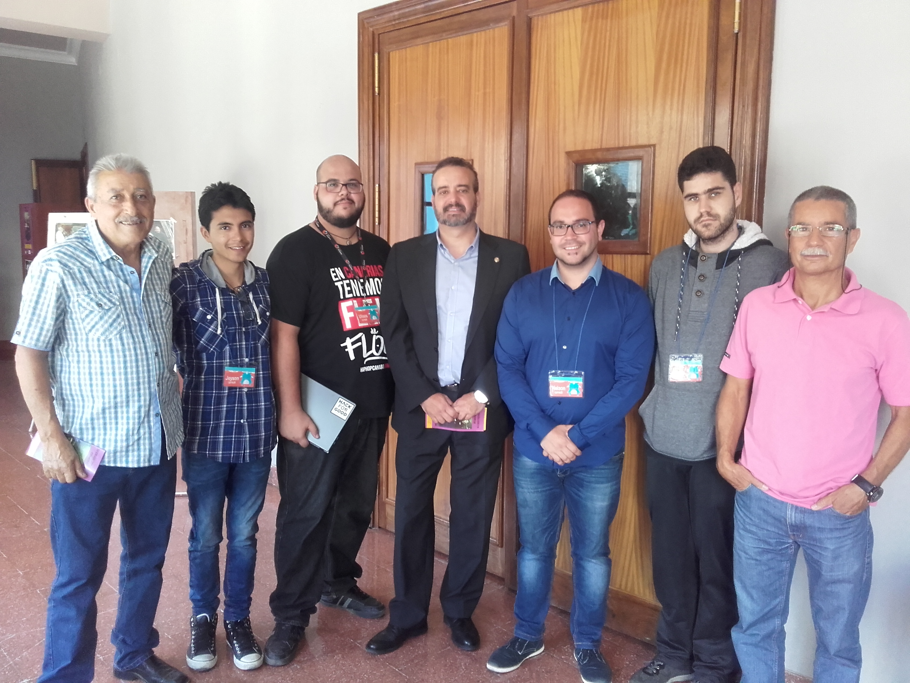

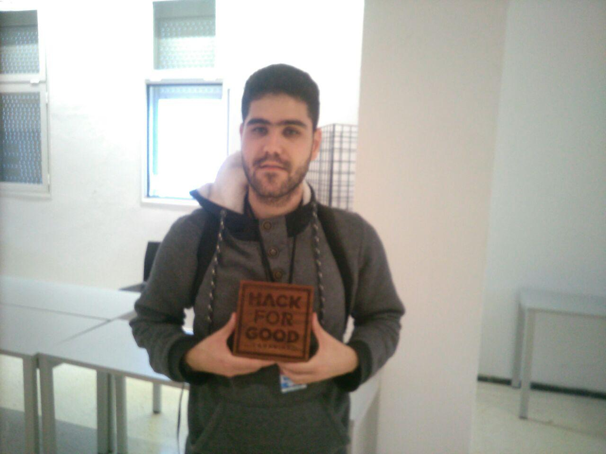

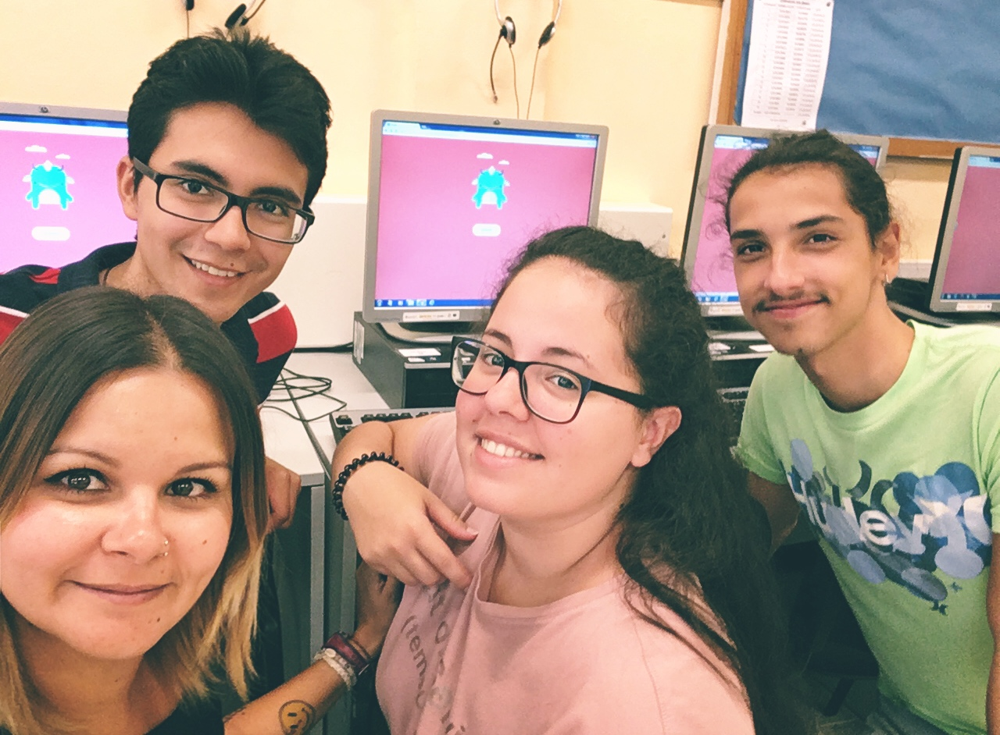

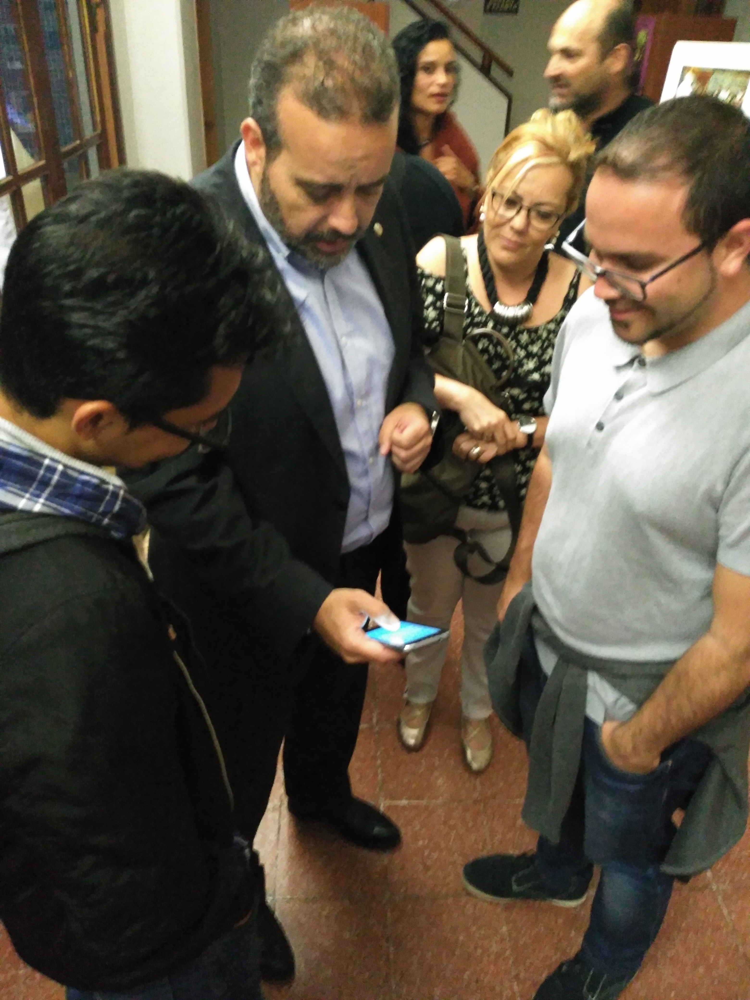

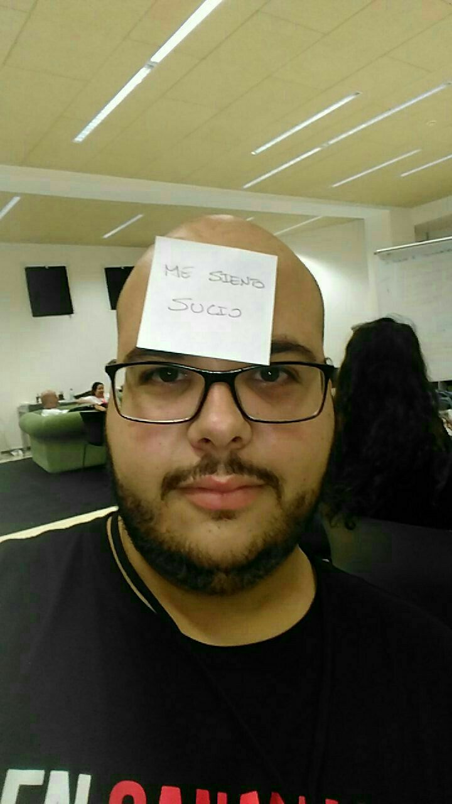

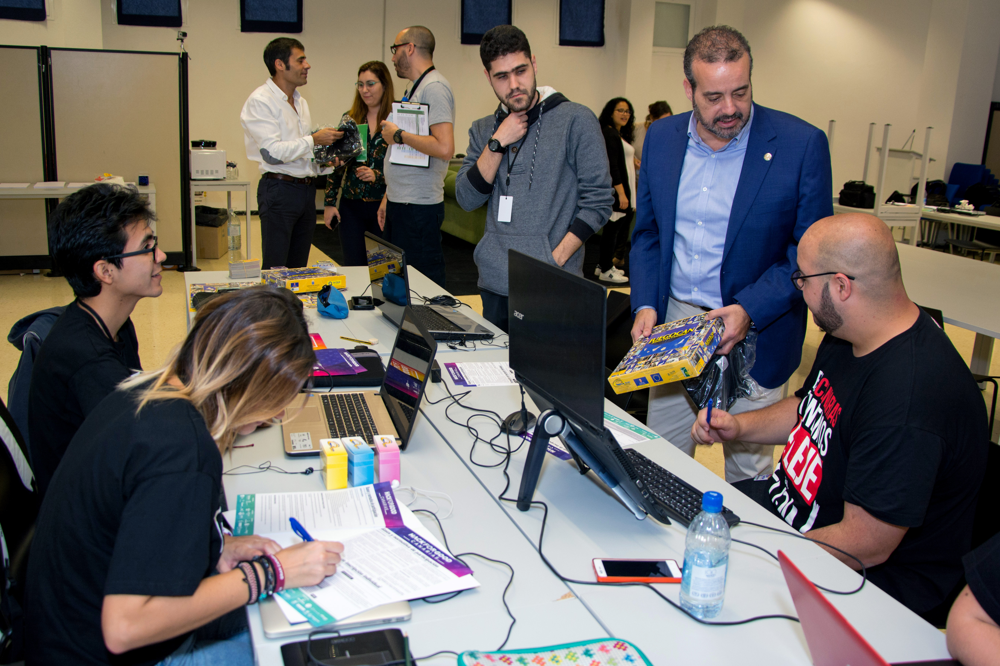

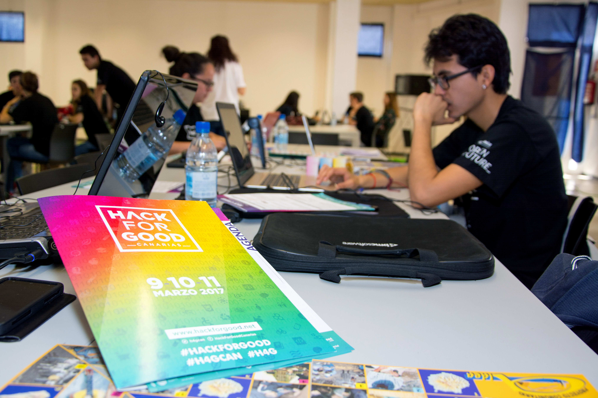

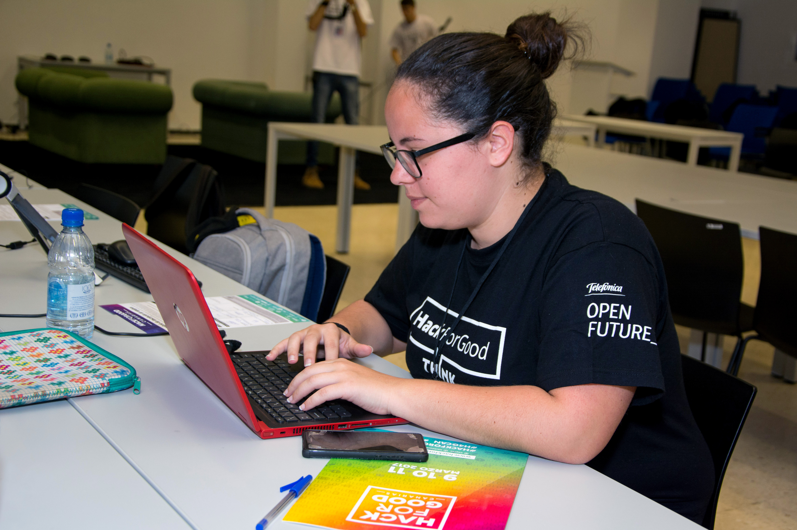

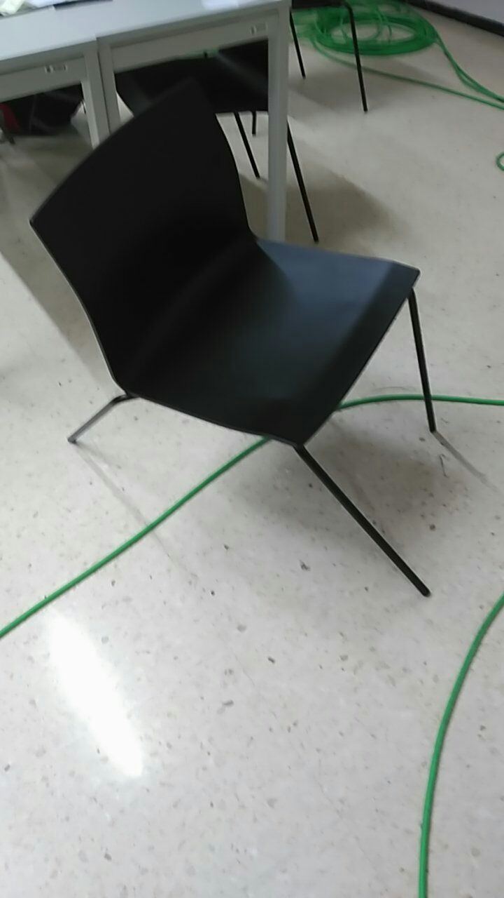

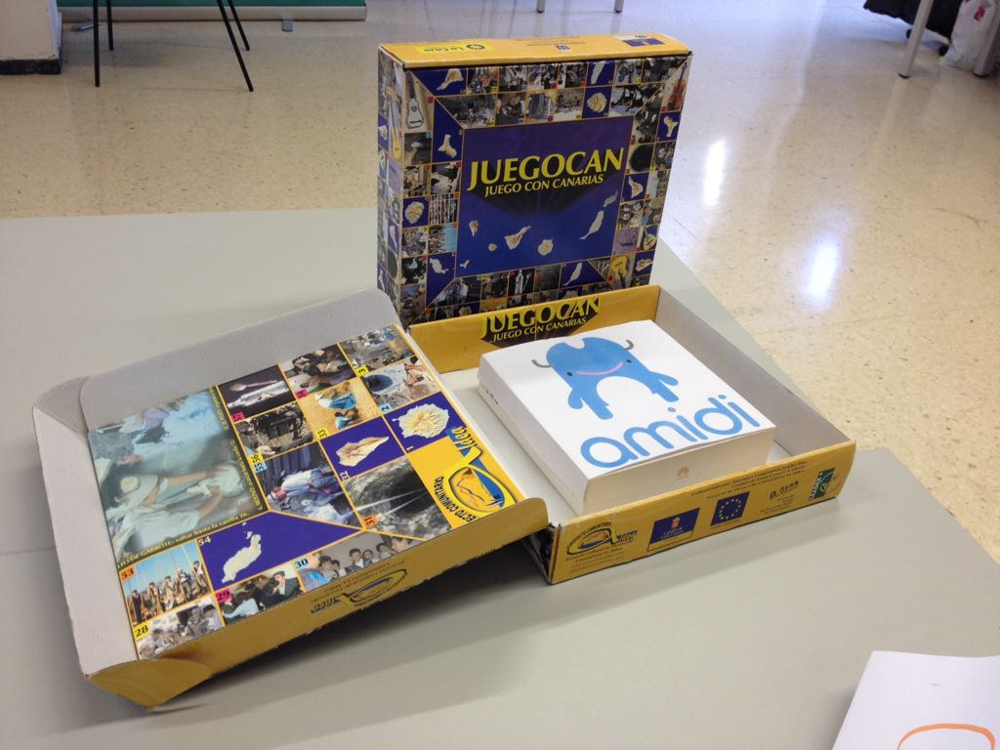

